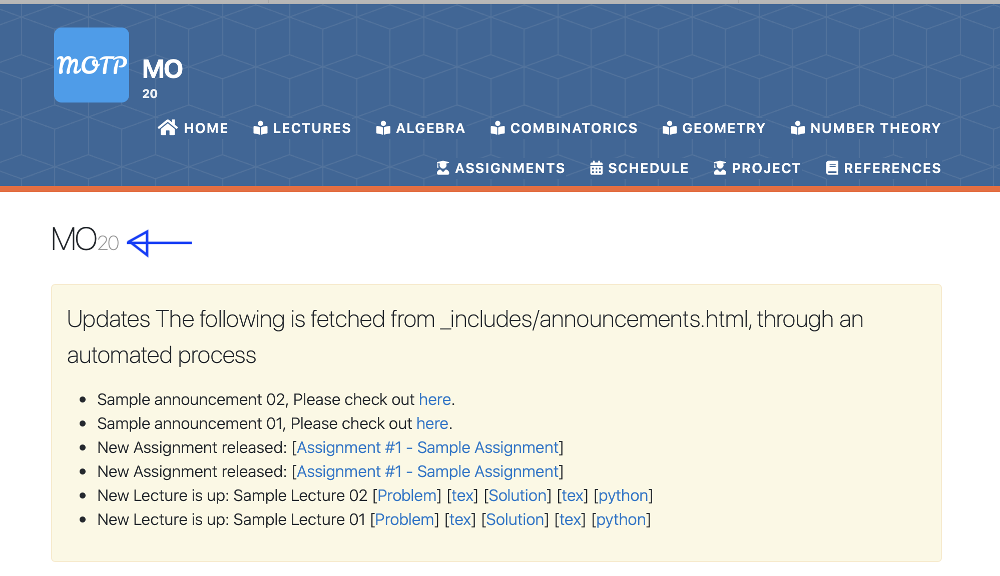

* In the file `_config.yml`, after putting course_name: MO and course_semester: "20",
all the pages on MOTP, when browsed, shows Algebra - MO / 20, Geometry - MO / 20 etc.
* Fine! But from do we get the slash in MO / 20?
  * In the file `_layouts/home.html`, removed a space before <span style, and removed a slash-space (/ ) after 6;">.
  * After building the page, one observes that the above process does remove the slash from Algebra - MO / 20, Geometry - MO / 20.
    But it removed the slash from MO/20 as shown below.
    
<p float="left">

</p>

* Slashing once again
  * No matter whatever layout is chosen, page or home within index.md, algebra.md etc., it does not change the *head* (Algebra - MO / 20, Geometry - MO / 20),
   for example removing the slash.
  * In the beginning of the files `_layouts/home.html`, `_layouts/page.html`, the layout is indicated as default.
   `_layouts/default.html` begins with head.html, which is located at `_includes/head.html`. In line 21 of head.html, the title is defined.

Replaced 

```markdown
---
<title> {{ page.title }} - {{ site.course_name }} / {{ site.course_semester }} {{ site.course_name }} / {{ site.course_semester }} - {{ site.schoolname }}</title>
```
by

```markdown
---
<title> {{ page.title }} {{ site.course_name }} / {{ site.course_semester }} - {{ site.schoolname }}</title>
```

* If you go to the Assignments page (by clicking on Assignments tab), and click on an individual Assignment (say, Assignment 1),
**(Notice the difference between Assignments and Assignment, this helps to understand what Assignments.html and Assignment.html could be about)**
then you will be redirected to the page of that individual Assignment, which includes a Late Policy.
This can be removed by commenting the Late policy in `_layouts/assignment.html`.

<p float="left">


</p>
